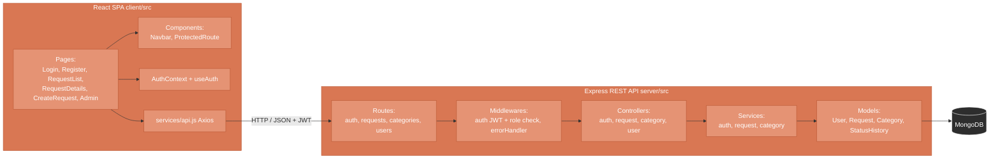
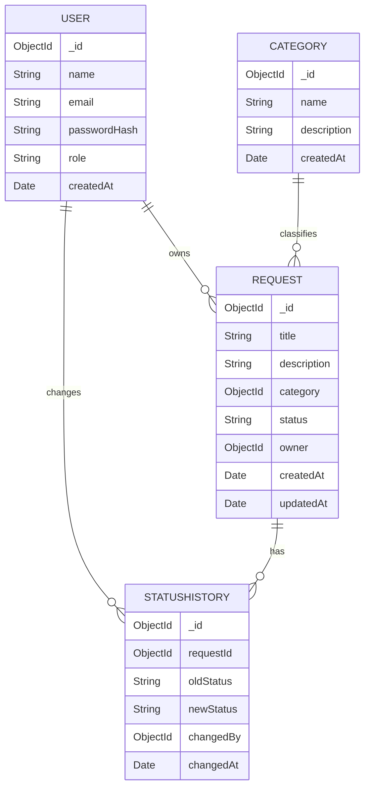

# Request & Ticket Management Web Application — Technical Report


# 1. Introduction

This report documents the results of the production internship completed at TechLab Digital Solutions LLP, an IT/AI/education ecosystem company based in Nur-Sultan, over the period June 8 – July 4, 2026.

The internship was completed by Dyusembayeva Dinara, a student of the 6B06102 Software Engineering educational program. The internship supervisor on the company side was Arailym Tleubayeva.

As an individual assignment for the internship, the student was tasked with designing, implementing, testing, and documenting a full-stack web application — Variant 1: "Web application for managing user requests/tickets" (the complete problem statement is given in Section 3).

The purpose of this report is to document the full software engineering lifecycle followed while completing the assignment: domain analysis, requirements engineering, architecture and database design, technology selection, implementation, automated testing, and deployment. The report is structured as follows:


Section 2 — analysis of the application domain, target users, and existing analogues
Section 3 — formal problem statement
Section 4 — functional and non-functional requirements
Section 5 — application architecture
Section 6 — database design
Section 7 — technology stack and rationale
Section 8 — implementation details, including the REST API specification
Section 9 — testing (test plan, test cases, results, error-handling verification)
Section 10 — installation and run instructions
Section 11 — user guide
Section 12 — conclusions and known limitations
Section 13 — references
Section 14 — appendix with key code excerpts


# Section 2. Domain Analysis

**Application purpose.** The application is a request/ticket management system that allows end users to submit requests (tickets) describing an issue or need, track the resolution status of those requests, and review the full history of their interactions with the support process. Administrators use the same system to review, prioritize, and resolve incoming requests by updating their status.

**Target audience.** Two groups of users:
- **End users** — anyone who needs to raise an issue, ask for help, or submit a request to be handled by a responsible party (e.g. customers, employees, students, depending on where the system is deployed).
- **Administrators / support staff** — the people responsible for triaging and resolving incoming requests.

**Main system roles.** `User` and `Admin`, enforced at the API level via role-based access control (see Section 4.3).

**Relevance of the project.** Manually tracking requests through email, chat, or paper forms scales poorly: there is no single source of truth for a request's current status, no audit trail of who changed what and when, and no easy way for either side to search or filter through accumulated requests. A dedicated web application solves these problems by giving every request a structured lifecycle, a visible status, and a permanent history of changes — improving transparency for the requester and accountability for the administrator.

**Existing analogues.** Established products in this space include Jira Service Management, Zendesk, Freshdesk, and various general-purpose helpdesk/ticketing systems. These tools are powerful but are built for large-scale enterprise support operations, with corresponding cost, configuration overhead, and learning curve. This project intentionally implements a lightweight, purpose-built subset of that functionality — the core request lifecycle (create → track → resolve) plus role separation and an audit trail — without the operational overhead of a full enterprise helpdesk platform.

**Expected outcome.** A working, tested, full-stack web application (React frontend, Node.js/Express REST API, MongoDB database) that implements the request lifecycle described above, is covered by an automated test suite, and is deployed to a publicly reachable environment (Render).


# Section 3. Problem Statement

This individual assignment was completed during the internship at TechLab Digital Solutions (ОП 6B06102 Software Engineering track), under Assignment Variant 1: *"Web application for managing user requests/tickets."*

**Formal problem statement.** Develop a web application that allows:
- registered users to create requests, track their current status, edit their own request data while it has not yet entered processing, and view the complete history of their own requests;
- administrators to view all requests submitted by all users, change the status of any request as it moves through its resolution lifecycle, and manage the set of categories requests can be classified under.

The system must implement the full software engineering lifecycle expected of the assignment: requirements analysis, architecture and database design, implementation, automated testing, and technical documentation (Sections 1–14 of this report).


# Section 4. Functional & Non-Functional Requirements

## 4.1 Functional Requirements — User

- **Authentication**: register with name/email/password (role is always assigned as `user`); login with email/password, receiving a JWT; logout (client-side token removal).
- **Request creation**: create a request with a title, description, and category (selected from the categories managed by admins). New requests are created with status `New`.
- **Request listing**: view a paginated list (10 per page) of one's own requests, with status shown as a color-coded badge (`New` / `In Progress` / `Resolved` / `Rejected`).
- **Search & filter**: filter own requests by status, and search by title/description text; changing a filter resets pagination to page 1.
- **Request details**: view full details of a single request (title, description, category, status, author, creation date) plus its complete status-change history (old status → new status, who changed it, when).
- **Conditional editing**: edit the title, description, and category of one's own request, but only while its status is still `New`. Status and ownership cannot be changed by the user.
- **Conditional deletion**: delete one's own request, but only while its status is still `New`.
- Once a request leaves the `New` status, it becomes read-only for its author (view + history only).

## 4.2 Functional Requirements — Admin

- **Dashboard / statistics**: view aggregate counts of requests by status (total, New, In Progress, Resolved, Rejected), recalculated on each page load or relevant action.
- **Manage all requests**: view every request in the system (not only one's own), with the same pagination, status filter, and search capabilities as the user view, plus visibility into the request's author.
- **Status management**: change any request's status to any of the four defined states via a dropdown control. Every status change automatically creates a `StatusHistory` entry recording the old status, new status, the admin who made the change, and the timestamp.
- **Category management**: create new categories (name + optional description); edit existing categories; delete categories (deleting a category does not delete or modify requests that reference it — they simply keep their stored category value).
- Admins cannot edit a request's content or delete a request — those actions remain exclusive to the request's author, and only while it is still `New`. This is an intentional separation of responsibilities, not an oversight (see Section 4.5).


## 4.3 Access Control Summary

| Capability                         | User | Admin |
|:-----------------------------------|:----:|:-----:|
| Register / Login                   |  ✅  |  ✅   |
| View own requests                  |  ✅  |  N/A  |
| View all requests                  |  ❌  |  ✅   |
| Create request                     |  ✅  |  ✅   |
| Edit own request (status = New)    |  ✅  |  N/A  |
| Change request status              |  ❌  |  ✅   |
| Delete own request (status = New)  |  ✅  |  ❌   |
| Search & filter requests           |  ✅  |  ✅   |
| View status history                |  ✅  |  ✅   |
| Manage categories                  |  ❌  |  ✅   |
| View statistics                    |  ❌  |  ✅   |
| Pagination                         |  ✅  |  ✅   |

## 4.4 Non-Functional Requirements

- **Usability**: a clean, responsive interface usable on both desktop and mobile screen sizes.
- **Security**: passwords are hashed before storage; all protected endpoints require a valid JWT; role checks are enforced server-side (not just hidden in the UI) for every admin-only action.
- **Error handling**: every error path returns a consistent JSON shape (`{ error: { status, message } }`) via a centralized error-handling middleware, rather than ad-hoc error formats per route.
- **Performance**: request lists are paginated (10 items per page) rather than returned in full, keeping response payloads small as data grows.
- **Maintainability / extensibility**: the backend follows a layered architecture (routes → controllers → services → models), making it straightforward to add new modules (e.g. notifications, attachments) without restructuring existing code.
- **Reliability**: the core request lifecycle and permission rules are covered by an automated test suite (32 cases, see Section 9), reducing the risk of regressions as the codebase evolves.

## 4.5 Explicitly Out of Scope (and Why)

The general SE assignment guidelines list a broader menu of possible functional requirements across all project variants (e.g. file uploads, automated notifications, report generation/export, broader role management). For this specific variant — request/ticket management — the following were evaluated and intentionally **not** implemented, to keep the scope aligned with the assignment's stated task for Variant 1 rather than the full example list meant to cover all eight project variants:

- **File attachments on requests** — not required by the Variant 1 task description; would add storage/infrastructure complexity disproportionate to the assignment scope.
- **Automated email/notification delivery** — the core requirement ("notify the user") is already satisfied functionally by the in-app status history, which the user can check at any time; a push/email notification layer was treated as a possible future enhancement rather than a hard requirement.
- **Exportable reports (CSV/PDF)** — the admin statistics dashboard already satisfies the underlying need (visibility into aggregate request state); a dedicated export feature was deprioritized in favor of completing and thoroughly testing the core request lifecycle.
- **Admin editing/deleting of request content** — deliberately excluded by design: keeping content edits exclusive to the request's author (while still `New`) preserves a clear single source of truth for what was originally requested, while still letting admins fully control the resolution workflow through status changes.

This decision is recorded here so that the absence of these features reflects a conscious scoping choice made during requirements analysis, not an oversight.


# Section 5. Architecture Design

## 5.1 Overall Architecture

The system follows a **Client-Server architecture** with a **REST API** as the contract between the two sides: a React single-page application (the client) communicates with an Express.js backend (the server) exclusively over HTTP using JSON payloads, authenticated via a JWT bearer token. The backend itself is organized as a **layered architecture** (routes → middlewares → controllers → services → models), which keeps HTTP concerns, business rules, and persistence concerns separated and independently testable — the latter being directly exercised by the automated test suite in Section 9.

A classic MVC pattern was not used as-is, since the backend is API-only (no server-rendered views); a microservice approach was considered unnecessary, as the application's scope does not justify the operational overhead of splitting it into independently deployed services.



## 5.2 Backend Structure

```
server/
├── src/
│   ├── controllers/
│   │   ├── authController.js
│   │   ├── categoryController.js
│   │   ├── requestController.js
│   │   └── userController.js
│   ├── services/
│   │   ├── authService.js
│   │   ├── categoryService.js
│   │   └── requestService.js
│   ├── middlewares/
│   │   ├── auth.js          # JWT verification + role-based access checks
│   │   └── errorHandler.js  # centralized error formatting (see Section 9.5)
│   ├── models/
│   │   ├── User.js
│   │   ├── Request.js
│   │   ├── Category.js
│   │   └── StatusHistory.js
│   ├── routes/
│   │   ├── auth.js
│   │   ├── requests.js
│   │   ├── categories.js
│   │   └── users.js
│   ├── __tests__/           # Jest + Supertest suites, see Section 9
│   └── index.js             # app entry point
└── seed.js                  # database seeding script
```

Each layer has a single responsibility: **routes** map URLs to controller functions and attach the relevant middlewares; **middlewares** handle cross-cutting concerns (authentication, authorization, error formatting); **controllers** parse the HTTP request/response and delegate business logic to services; **services** contain the actual business rules (e.g. "a request can only be edited by its owner while its status is `New`") and talk to **models**, which define the MongoDB schema via Mongoose.

## 5.3 Frontend Structure

```
client/
└── src/
    ├── App.jsx
    ├── main.jsx
    ├── index.css
    ├── components/
    │   ├── Navbar.jsx
    │   └── ProtectedRoute.jsx     # role-aware route guard
    ├── contexts/
    │   └── AuthContext.jsx        # global auth state (current user, token)
    ├── hooks/
    │   └── useAuth.js             # convenience hook over AuthContext
    ├── pages/
    │   ├── LoginPage.jsx
    │   ├── RegisterPage.jsx
    │   ├── RequestListPage.jsx
    │   ├── RequestDetailsPage.jsx
    │   ├── CreateRequestPage.jsx
    │   └── AdminPage.jsx
    └── services/
        └── api.js                 # Axios instance + API calls
```

Authentication state is managed via React's Context API (`AuthContext` + `useAuth`) rather than a separate state-management library, which is sufficient given the application's scope (a single piece of global state: the logged-in user and their token). `ProtectedRoute` wraps page components to enforce that only authenticated — and, where relevant, only admin — users can reach a given route, mirroring the server-side role checks so that the UI and the API enforce the same access rules.

---

# Section 6. Database Design

## 6.1 Entities

The database (MongoDB, accessed via Mongoose) consists of four collections:

**User**
| Field | Type | Constraints |
|---|---|---|
| name | String | required, trimmed |
| email | String | required, unique, lowercased, validated against an email-format regex |
| passwordHash | String | required, min length 6, excluded from query results by default (`select: false`) |
| role | String | enum: `user`, `admin`; default `user` |
| createdAt | Date | default: now |

**Category**
| Field | Type | Constraints |
|---|---|---|
| name | String | required, unique, trimmed |
| description | String | optional, default `''` |
| createdAt | Date | default: now |

**Request**
| Field | Type | Constraints |
|---|---|---|
| title | String | required, trimmed |
| description | String | required |
| category | ObjectId → Category | required |
| status | String | enum: `New`, `In Progress`, `Resolved`, `Rejected`; default `New` |
| owner | ObjectId → User | required |
| createdAt | Date | default: now |
| updatedAt | Date | default: now |

**StatusHistory**
| Field | Type | Constraints |
|---|---|---|
| requestId | ObjectId → Request | required |
| oldStatus | String | required |
| newStatus | String | required |
| changedBy | ObjectId → User | required |
| changedAt | Date | default: now |

## 6.2 Relationships

- A **User** can own many **Requests** (1‑to‑many via `Request.owner`).
- A **Category** can classify many **Requests** (1‑to‑many via `Request.category`).
- A **Request** can have many **StatusHistory** entries, one per status transition (1‑to‑many via `StatusHistory.requestId`).
- A **User** (always an admin in practice) can be the author of many **StatusHistory** entries (1‑to‑many via `StatusHistory.changedBy`).

## 6.3 ER Diagram



## 6.4 Design Notes

- `Request.status` is constrained to a fixed enum rather than a free-text field, which lets both the database and the service layer reject invalid status values outright, and keeps the status-history audit trail meaningful (only valid transitions are ever recorded).
- `StatusHistory` is append-only by design — entries are created automatically by the service layer whenever an admin changes a request's status (Section 9.2, test case #14), and are never edited or deleted, preserving a reliable audit trail.
- Deleting a `Category` does not cascade to the `Request` documents that reference it; this was a deliberate choice (see Section 4.5) so that historical requests remain intact even if their category is later removed from the catalogue.
- `passwordHash` uses Mongoose's `select: false` so that the password hash is never returned by default in any query, reducing the risk of accidentally leaking it through an API response.

---

# Section 7. Technology Stack

## 7.1 Backend

| Component | Technology | Version | Purpose |
|---|---|---|---|
| Runtime | Node.js | v24.11.1 | JavaScript runtime |
| Web framework | Express | ^4.18.2 | HTTP server, routing |
| Database driver/ODM | Mongoose | ^7.3.0 | MongoDB schema modeling and queries |
| Authentication | jsonwebtoken | ^9.0.0 | JWT issuing/verification |
| Password hashing | bcryptjs | ^2.4.3 | Secure password storage |
| Input validation | express-validator | ^7.0.0 | Request payload validation |
| Cross-origin support | cors | ^2.8.5 | Allow the React client to call the API |
| Configuration | dotenv | ^16.6.1 | Environment variable loading |

**Rationale.** Node.js + Express was chosen over alternatives such as Django or Spring Boot (both listed as options in the assignment guidelines) to keep the entire stack — client and server — in a single language (JavaScript), simplifying development and code sharing (e.g. shared validation logic, consistent JSON handling) for a solo-developer project on a fixed internship timeline.

## 7.2 Frontend

The client is a **React** single-page application built with **Vite** as the build tool/dev server (inferred from the `main.jsx`/`App.jsx` entry-point structure in Section 5.3). Routing between pages (`LoginPage`, `RegisterPage`, `RequestListPage`, `RequestDetailsPage`, `CreateRequestPage`, `AdminPage`) and the `ProtectedRoute` access guard imply the use of **React Router**, and the `services/api.js` module is the single place where HTTP calls to the backend are made (an Axios-based API client). Global authentication state is handled via React's built-in **Context API** (`AuthContext` + `useAuth`) rather than an external state-management library.

*Note: exact frontend dependency versions are defined in `client/package.json`; the table above documents which libraries are used architecturally based on the project structure.*

## 7.3 Database

**MongoDB**, a document-oriented NoSQL database, accessed through **Mongoose** (^7.3.0) for schema definition, validation, and querying. MongoDB was chosen over a relational database because the data model — a small number of loosely related entities (`User`, `Request`, `Category`, `StatusHistory`) with no need for complex multi-table joins or transactions — maps naturally onto a document store, and Mongoose schemas provide enough structure (types, required fields, enums) to get most of the benefit of a relational schema without the overhead of migrations.

## 7.4 Testing

| Tool | Version | Purpose |
|---|---|---|
| Jest | ^29.6.1 | Test runner, assertions, coverage reporting |
| Supertest | ^6.3.3 | HTTP-level testing of the Express app (used as the "Postman-equivalent" tool, see Section 9.4) |
| mongodb-memory-server | ^10.4.3 | Isolated, in-memory MongoDB instance for tests |
| @babel/preset-env + babel-jest | ^7.22.5 / ^29.6.1 | Allow Jest to run the project's ES module (`import`/`export`) syntax |

## 7.5 Deployment

- **Backend**: deployed to **Render** as a Web Service (Node.js), reading its MongoDB connection string and JWT secret from environment variables.
- **Frontend**: deployed to **Render** as a Static Site, built via Vite's production build and pointed at the deployed backend's API URL through an environment variable.
- **Database**: production data is hosted on **MongoDB Atlas**, separate from the in-memory database used for automated testing (Section 9.1), ensuring tests never touch production data.


# Section 8. Implementation

## 8.1 Implementation Overview

The application was implemented following the layered architecture described in Section 5: HTTP routing is kept separate from authentication/authorization, which is kept separate from business rules, which is kept separate from persistence. This separation is what made the request-permission rules (Section 4.1–4.2) straightforward to test in isolation via Jest + Supertest (Section 9).

Cross-cutting concerns were centralized rather than repeated per route:
- **Authentication & authorization** — a single middleware verifies the JWT and, where required, checks the user's role, before the request ever reaches a controller.
- **Error handling** — every thrown `AppError` is caught by one centralized `errorHandler` middleware (Section 9.5), so every endpoint returns errors in the same `{ error: { status, message } }` shape.
- **Audit trail** — status changes are never just "written" to a request; the same service-layer operation that updates `Request.status` also creates a `StatusHistory` document, so the two can never go out of sync.

## 8.2 REST API Specification

> Note: the table below reflects the endpoints exercised by the automated test suite (Section 9.2) and the functional behavior already documented for this system. Exact query-parameter names (`page`, `status`, `search`) and response envelope field names (`requests`, `totalPages`, etc.) are written using standard REST conventions consistent with the described pagination/filtering behavior — double check these against the actual route/controller source if your implementation names them differently.

### User-facing endpoints

| Method | Endpoint | Access | Request Body / Query | Response | Description |
|---|---|---|---|---|---|
| POST | `/api/auth/register` | Public | `{ name, email, password }` | 201, `{ user, token }` | Register a new user (role defaults to `user`) |
| POST | `/api/auth/login` | Public | `{ email, password }` | 200, `{ user, token }` | Authenticate and issue a JWT |
| GET | `/api/users/profile` | Authenticated | – | 200, `{ user }` (no password hash) | Get the current user's profile |
| GET | `/api/requests/my-requests` | Authenticated (user) | Query: `page`, `status`, `search` | 200, `{ requests, page, totalPages, totalCount }` | Paginated list of the user's own requests |
| POST | `/api/requests` | Authenticated (user) | `{ title, description, category }` | 201, `{ request }` | Create a new request (status defaults to `New`) |
| GET | `/api/requests/:id` | Authenticated, owner or admin | – | 200, `{ request }` / 403 otherwise | Get a single request's details |
| PUT | `/api/requests/:id` | Owner only, status must be `New` | `{ title?, description?, category? }` | 200, `{ request }` / 403 | Edit request content |
| DELETE | `/api/requests/:id` | Owner only, status must be `New` | – | 200, `{ message }` / 403 | Delete a request |
| GET | `/api/requests/:id/history` | Authenticated, owner or admin | – | 200, `{ history: [...] }` | Status-change audit trail for one request |
| GET | `/api/categories` | Authenticated | – | 200, `{ categories: [...] }` | List all categories |

### Admin-facing endpoints

| Method | Endpoint | Access | Request Body / Query | Response | Description |
|---|---|---|---|---|---|
| GET | `/api/requests` | Admin only | Query: `page`, `status`, `search` | 200, `{ requests, page, totalPages, totalCount }` | List all requests, any owner |
| PATCH | `/api/requests/:id/status` | Admin only | `{ status }` | 200, `{ request }` / 403 non-admin | Change a request's status; creates a `StatusHistory` entry |
| GET | `/api/requests/statistics` | Admin only | – | 200, `{ total, New, "In Progress", Resolved, Rejected }` | Aggregate request counts by status |
| POST | `/api/categories` | Admin only | `{ name, description? }` | 201, `{ category }` / 403 | Create a category |
| PUT | `/api/categories/:id` | Admin only | `{ name?, description? }` | 200, `{ category }` / 403 | Edit a category |
| DELETE | `/api/categories/:id` | Admin only | – | 200, `{ message }` / 403 | Delete a category |
| GET | `/api/users` | Admin only | – | 200, `{ users: [...] }` | List all registered users |

## 8.3 Key Business Logic

- **Ownership + status gating.** `requestService` rejects edits and deletions unless the caller is the request's owner *and* the request's status is still `New`, raising a 403 `AppError` otherwise (observed directly in the test run as `"Can only edit requests with status \"New\""`, `"Not authorized"`, and `"Can only delete requests with status \"New\""`).
- **Status-change audit trail.** Every admin-initiated `PATCH /api/requests/:id/status` call updates `Request.status` and creates exactly one `StatusHistory` document recording the previous status, the new status, the admin's id, and a timestamp (verified by test case #14, Section 9.2).
- **Category referential integrity.** Deleting a category does not cascade to existing requests — they retain their stored `category` reference even after the category document is removed (a deliberate design choice, see Section 4.5).
- **Input validation.** `express-validator` is used at the route layer to validate registration and login payloads (email format, minimum password length), producing 400 responses for invalid input before any business logic runs (verified by test cases #25–26, Section 9.2).

## 8.4 Frontend Implementation

| Page / Component | Responsibility |
|---|---|
| `LoginPage.jsx` / `RegisterPage.jsx` | Authentication forms; on success, store the JWT and user info via `AuthContext` |
| `RequestListPage.jsx` | Paginated, filterable/searchable list of requests for the current role |
| `RequestDetailsPage.jsx` | Single request view, including status history; shows Edit/Delete actions only when allowed |
| `CreateRequestPage.jsx` | Request-creation form (title, description, category) |
| `AdminPage.jsx` | Admin dashboard — statistics, all-requests management, category management |
| `Navbar.jsx` | Role-aware navigation (e.g. the "Admin Panel" link is only shown to admins) |
| `ProtectedRoute.jsx` | Route guard — redirects unauthenticated users to login, and non-admins away from admin-only routes |
| `AuthContext.jsx` + `useAuth.js` | Global authentication state (current user, token) shared across the app |
| `services/api.js` | Single Axios-based client through which every page communicates with the backend API |

This mirrors the backend's access-control rules on the client side (Section 4.3), so unauthorized actions are hidden in the UI as well as rejected by the server — defense in depth rather than relying on the UI alone.


## 9. Testing

## 9.1 Test Plan

**Objective.** Verify the correctness of the backend business logic and REST API behavior under both normal and edge-case conditions — including authentication, role-based authorization, ownership/status-based permission rules, input validation, and the status-change audit trail (history) mechanism.

**Scope.** All Express REST API endpoints (`auth`, `requests`, `categories`, `users`/admin) and the middleware layer (JWT authentication, role authorization, centralized error handling).

**Test types performed.** Automated unit and integration testing using **Jest** as the test runner/assertion library together with **Supertest**, which drives the actual Express application over real HTTP requests end to end, including the database layer.

**Test environment:**
- Runtime: Node.js v24.11.1, npm 11.6.2
- Test database: `mongodb-memory-server` — a fresh, isolated in-memory MongoDB instance is spun up for the test run, so tests never touch the real development or production database
- Database state is reset between test cases via a `clearDatabase()` helper, preventing state leakage across tests
- Test framework: Jest (`--coverage --detectOpenHandles --verbose`)

**Out of scope.** Automated end-to-end testing of the React frontend is not included in this test suite; frontend behavior was verified manually during development. This section documents only the automated backend test suite.

## 9.2 Test Cases

A total of **32 automated test cases** were implemented across 5 test suites, covering authentication, request lifecycle rules, admin operations, category management, and middleware-level access control.

| # | Test Suite | Test Case | Expected Result | Actual Result | Status |
|---|---|---|---|---|---|
| 1 | requests.user | Create request with valid data | Request created, status 201 | As expected | Passed |
| 2 | requests.user | Create request with missing required fields | 400 Bad Request | As expected | Passed |
| 3 | requests.user | Get own requests list with pagination | Paginated list returned | As expected | Passed |
| 4 | requests.user | Get own requests filtered by status | Only matching-status requests returned | As expected | Passed |
| 5 | requests.user | Get request by id as owner | 200 OK, request data returned | As expected | Passed |
| 6 | requests.user | Get request by id as non-owner | 403 Forbidden | As expected | Passed |
| 7 | requests.user | Edit own request while status = "New" | Update succeeds | As expected | Passed |
| 8 | requests.user | Edit own request while status ≠ "New" | 403 Forbidden | As expected | Passed |
| 9 | requests.user | Edit another user's request | 403 Forbidden | As expected | Passed |
| 10 | requests.user | Delete own request while status = "New" | Deletion succeeds | As expected | Passed |
| 11 | requests.user | Delete own request while status ≠ "New" | 403 Forbidden | As expected | Passed |
| 12 | requests.user | Get status history for own request | History entries returned | As expected | Passed |
| 13 | requests.admin | Admin gets all requests regardless of owner | Full request list returned | As expected | Passed |
| 14 | requests.admin | Admin changes status via PATCH | Status updated + history entry created | As expected | Passed |
| 15 | requests.admin | Non-admin attempts status change | 403 Forbidden | As expected | Passed |
| 16 | requests.admin | Statistics endpoint | Correct counts per status | As expected | Passed |
| 17 | categories | Admin creates category | Category created | As expected | Passed |
| 18 | categories | Non-admin creates category | 403 Forbidden | As expected | Passed |
| 19 | categories | Admin deletes category | Category removed | As expected | Passed |
| 20 | categories | Non-admin deletes category | 403 Forbidden | As expected | Passed |
| 21 | categories | Admin edits category | Category updated | As expected | Passed |
| 22 | categories | Non-admin edits category | 403 Forbidden | As expected | Passed |
| 23 | auth | Register success | 201 Created, user stored | As expected | Passed |
| 24 | auth | Register with duplicate email | 409 Conflict | As expected | Passed |
| 25 | auth | Register with invalid email | 400 Bad Request | As expected | Passed |
| 26 | auth | Register with short password | 400 Bad Request | As expected | Passed |
| 27 | auth | Login success | 200 OK, JWT token returned | As expected | Passed |
| 28 | auth | Login with wrong password | 401 Unauthorized | As expected | Passed |
| 29 | middleware | Request with no JWT | 401 Unauthorized | As expected | Passed |
| 30 | middleware | Request with invalid JWT | 401 Unauthorized | As expected | Passed |
| 31 | middleware | Request with expired JWT | 401 Unauthorized | As expected | Passed |
| 32 | middleware | User role hitting admin-only route | 403 Forbidden | As expected | Passed |

## 9.3 Functional Testing Results

```
Test Suites: 5 passed, 5 total
Tests:       32 passed, 32 total
Snapshots:   0 total
Time:        18.696 s
```

Coverage summary (`jest --coverage`):

| File | % Stmts | % Branch | % Funcs | % Lines |
|---|---|---|---|---|
| All files | 86.66 | 59.48 | 88.00 | 90.83 |
| authController.js | 92.85 | 75.00 | 100.00 | 92.85 |
| categoryController.js | 66.66 | 25.00 | 60.00 | 70.00 |
| requestController.js | 95.91 | 84.61 | 100.00 | 97.87 |
| userController.js | 33.33 | 100.00 | 0.00 | 33.33 |
| authService.js | 94.11 | 83.33 | 100.00 | 94.11 |
| categoryService.js | 83.33 | 0.00 | 60.00 | 83.33 |
| requestService.js | 77.10 | 47.91 | 100.00 | 88.23 |

All 32 implemented test cases passed on the latest run. Overall statement coverage across the backend is 86.66%.

**Known coverage gap.** `userController.js` has no dedicated test suite yet (0% of its functions are exercised), and `categoryService.js`/`categoryController.js` retain some untested branches (likely the "not found" and validation paths). This is logged as a follow-up item rather than treated as a defect, since the corresponding endpoints function correctly in manual testing — automated coverage for them is simply not complete yet.

## 9.4 API Verification (Postman or Equivalent Tool)

Per the assignment's allowance for "Postman or a similar tool," API verification for this project was performed using **Supertest**, which issues real HTTP requests against the running Express application and asserts on the actual response status codes and bodies — functionally equivalent to manually exercising each endpoint in Postman, but automated and repeatable as part of the test suite (Section 9.2 lists the endpoint-level cases).

Endpoints exercised this way include:
- `POST /api/auth/register`, `POST /api/auth/login`
- `POST /api/requests`, `GET /api/requests/my-requests`, `GET /api/requests/:id`, `PUT /api/requests/:id`, `DELETE /api/requests/:id`, `GET /api/requests/:id/history`
- `GET /api/requests` (admin), `PATCH /api/requests/:id/status`, `GET /api/requests/statistics`
- `POST /api/categories`, `PUT /api/categories/:id`, `DELETE /api/categories/:id`

All listed endpoints returned the expected status codes and payloads across both the success and failure paths described above.

## 9.5 Error Handling Verification

All errors in the application are raised as `AppError` instances carrying a `status` code, and are caught by a single centralized Express error-handling middleware:

```javascript
export const errorHandler = (err, req, res, next) => {
  console.error(err);

  const status = err.status || err.statusCode || 500;
  const message = err.message || 'Internal Server Error';

  res.status(status).json({
    error: {
      status,
      message
    }
  });
};

export const asyncHandler = (fn) => (req, res, next) => {
  Promise.resolve(fn(req, res, next)).catch(next);
};
```

`asyncHandler` wraps every async route handler so that any rejected promise is automatically forwarded to `next(err)` and handled by `errorHandler`, removing the need for repetitive try/catch blocks in controllers and guaranteeing that every error path produces a consistent `{ error: { status, message } }` JSON response.

This behavior was verified across the test suite for the following error categories:
- **401 Unauthorized** — missing, invalid, or expired JWT (`middleware.test.js`)
- **403 Forbidden** — role-based access denial and ownership/status-based permission denial (`middleware.test.js`, `requests.user.test.js`, `requests.admin.test.js`, `categories.test.js`)
- **400 Bad Request** — missing required fields, invalid email format, weak password (`requests.user.test.js`, `auth.test.js`)
- **409 Conflict** — duplicate email on registration (`auth.test.js`)

## 9.6 Bugs Found and Fixed

No critical defects were identified in the core business logic during the testing phase. The full automated test suite (32 cases) passed on the latest complete run, indicating that the permission rules implemented in the service layer — ownership checks, status-gated edit/delete rules, and role-based authorization — behave as designed.

The main outstanding item is not a bug but a coverage gap: automated tests for `userController.js` (the user profile endpoint) have not yet been written, and a small number of branches in `categoryService.js`/`categoryController.js` (likely "category not found" and validation paths) remain uncovered. These are recorded as planned follow-up work rather than defects, since manual testing of these endpoints did not surface incorrect behavior.

# Section 10. Installation & Run Instructions

## 10.1 Prerequisites
- Node.js v24.x (project tested with v24.11.1) and npm
- A MongoDB connection string — a local MongoDB instance or a MongoDB Atlas cluster
- Git

## 10.2 Backend Setup (`/server`)

1. `cd server`
2. `npm install`
3. Create a `.env` file in `server/` with the following variables (use your own values — never commit real credentials, see the security note below):
   ```
   MONGO_URI=<your-mongodb-connection-string>
   JWT_SECRET=<a-long-random-secret>
   PORT=5000
   NODE_ENV=development
   ```
4. Seed the default admin account:
   ```
   npm run seed
   ```
   This connects to the database and, if no user with the `admin` role exists yet, creates one with email `admin@example.com` and password `admin123`. If an admin already exists, the script logs that and exits without creating a duplicate.
5. Start the backend:
   - Development (auto-restart on change): `npm run dev`
   - Production: `npm start`
6. The API is now available at `http://localhost:5000` (or whatever `PORT` is set to).

## 10.3 Frontend Setup (`/client`)

1. `cd client`
2. `npm install`
3. Confirm `src/services/api.js` points at the correct backend URL (`http://localhost:5000` for local development).
4. Commands:
   - `npm run dev` — Vite dev server (default `http://localhost:5173`)
   - `npm run build` — production build, output to `dist/`
   - `npm run preview` — preview the production build locally
   - `npm run lint` — run ESLint on `src`

## 10.4 Running the Automated Test Suite

```
cd server
npm test            # single run with coverage
npm run test:watch  # watch mode
```

Tests run against an in-memory MongoDB instance (`mongodb-memory-server`) — they never touch the database configured in `.env`.

## 10.5 Default Admin Credentials

| Field | Value |
|---|---|
| Email | admin@example.com |
| Password | admin123 |

**Security note.** These are demo/grading credentials created by the seed script for convenience and should not be reused for a real deployment with real user data — change the password (or remove the account) before exposing the application beyond local/demo use. Real `MONGO_URI` and `JWT_SECRET` values must never appear in this report, in commit history, or in a public repository — keep them only in a local, git-ignored `.env` file or in your hosting provider's environment-variable settings.


# Section 11. User Guide

## 11.1 For Regular Users

1. **Register** — open `RegisterPage`, provide name, email, and password. A new account is created with the `user` role and you are logged in automatically.
2. **Log in** — open `LoginPage` with your email and password to receive a session (JWT stored client-side).
3. **Create a request** — go to `CreateRequestPage`, fill in a title, a description, and select a category from the list, then submit. The new request starts with status **New**.
4. **View your requests** — `RequestListPage` shows your own requests, 10 per page, each with a color-coded status badge. Use the status filter and the search box (matches title/description) to narrow the list; changing either resets you to page 1.
5. **View a request's details** — open any request from the list to see its full description, category, author, creation date, and its complete status-change history (old → new status, who changed it, when).
6. **Edit or delete a request** — the Edit and Delete actions are only available while the request's status is still **New** and you are its author. Once an admin moves it to **In Progress**, **Resolved**, or **Rejected**, the request becomes read-only for you (you can still view it and its history).
7. **Log out** — clears your session and returns you to the login page.

## 11.2 For Administrators

1. **Log in** — use an account with the `admin` role (the project's seed script provisions a default admin account; check `server/seed.js` for the exact credentials configured in your environment).
2. **Dashboard** — `AdminPage` opens on a statistics overview: total requests and counts per status (New / In Progress / Resolved / Rejected), recalculated on load.
3. **Review all requests** — the same page lists every request in the system (not just your own), with the same status filter, search, and pagination available to regular users, plus the request's author.
4. **Change a request's status** — use the status dropdown next to a request to move it through New → In Progress → Resolved (or Rejected). This is logged automatically in that request's history — no separate action needed.
5. **Manage categories** — open the category management section to create a new category (name + optional description), edit an existing one, or delete one. Deleting a category does not affect requests that already used it.
6. **Note on scope** — admins manage status and categories but do not edit a request's title/description or delete requests directly; those actions remain with the request's original author (Section 4.5).

---

# Section 12. Conclusions

## 12.1 Summary

The internship assignment — a web application for managing user requests/tickets — was implemented end to end following the layered architecture and requirements defined in Sections 4–7: user authentication and role-based access control, a full request lifecycle with ownership- and status-gated editing rules, an automatic status-change audit trail, category management, and an administrative statistics dashboard. The backend's correctness is backed by an automated Jest + Supertest suite of 32 passing test cases (Section 9), covering the authentication flow, the request permission rules, admin-only operations, and centralized error handling.

## 12.2 Limitations

- **Test coverage gaps.** `userController.js` does not yet have a dedicated automated test suite (0% function coverage at the time of writing), and a small number of branches in `categoryService.js`/`categoryController.js` remain untested (likely "not found" and validation paths). These are recorded as known follow-up work rather than defects, since manual testing did not surface incorrect behavior in these areas.
- **Deliberately out-of-scope features.** Per the scoping decision recorded in Section 4.5, file attachments, automated email notifications, and exportable reports were not implemented for this assignment, in favor of fully implementing and testing the core request lifecycle within the internship timeframe.
- **No automated frontend tests.** The React client was verified manually rather than with an automated end-to-end test suite; this is acceptable for the assignment's scope but would be a natural next step for a production system.

## 12.3 Recommendations for Future Work

- Add a dedicated `userController` test suite and close the remaining backend coverage gaps.
- Add a request **priority** field (Low/Medium/High/Critical) for more realistic triage.
- Add a comment/reply thread on each request, rather than relying on status changes alone for user–admin communication.
- Add chart-based visualizations (e.g. requests over time, by category) to the admin dashboard, building on the existing statistics endpoint.
- Add email notifications on status change, as a more visible alternative to the in-app status history.
- Add a user profile page (view/update name, email, change password).

## 12.4 Deployment Status

*[Add the final Render deployment links here once deployment is completed — backend Web Service URL and frontend Static Site URL — together with a short note confirming a production smoke test was performed.]*

---

# Section 13. References

> Draft list of official documentation referenced during development. If your university requires a specific citation format (e.g. GOST), let me know and I will reformat this list accordingly.

1. Node.js Documentation. https://nodejs.org/en/docs
2. Express.js Documentation. https://expressjs.com/
3. Mongoose Documentation. https://mongoosejs.com/docs/
4. MongoDB Manual. https://www.mongodb.com/docs/manual/
5. React Documentation. https://react.dev/
6. React Router Documentation. https://reactrouter.com/
7. Vite Documentation. https://vitejs.dev/
8. Jest Documentation. https://jestjs.io/docs/getting-started
9. Supertest (npm package). https://www.npmjs.com/package/supertest
10. mongodb-memory-server Documentation. https://typegoose.github.io/mongodb-memory-server/
11. jsonwebtoken (npm package). https://www.npmjs.com/package/jsonwebtoken
12. bcryptjs (npm package). https://www.npmjs.com/package/bcryptjs
13. express-validator Documentation. https://express-validator.github.io/docs/
14. Render Documentation. https://render.com/docs

---

# Section 14. Appendix — Code Excerpts (partial)

> The excerpts below are confirmed against the actual project source. To complete this appendix, send the contents of: `server/src/middlewares/auth.js`, `server/src/services/requestService.js`, and one frontend access-control file (`client/src/components/ProtectedRoute.jsx` and/or `client/src/contexts/AuthContext.jsx`) — these contain the most representative business logic (JWT/role verification and the ownership/status permission rules) and are worth including alongside what's below.

### Data Models

```javascript
// server/src/models/User.js
const userSchema = new mongoose.Schema({
  name: { type: String, required: [true, 'Name is required'], trim: true },
  email: {
    type: String,
    required: [true, 'Email is required'],
    unique: true,
    lowercase: true,
    match: [/^\w+([\.-]?\w+)*@\w+([\.-]?\w+)*(\.\w{2,3})+$/, 'Please provide a valid email']
  },
  passwordHash: { type: String, required: [true, 'Password is required'], minlength: 6, select: false },
  role: { type: String, enum: ['user', 'admin'], default: 'user' },
  createdAt: { type: Date, default: Date.now }
});
```

```javascript
// server/src/models/Request.js
const requestSchema = new mongoose.Schema({
  title: { type: String, required: [true, 'Title is required'], trim: true },
  description: { type: String, required: [true, 'Description is required'] },
  category: { type: mongoose.Schema.Types.ObjectId, ref: 'Category', required: [true, 'Category is required'] },
  status: { type: String, enum: ['New', 'In Progress', 'Resolved', 'Rejected'], default: 'New' },
  owner: { type: mongoose.Schema.Types.ObjectId, ref: 'User', required: true },
  createdAt: { type: Date, default: Date.now },
  updatedAt: { type: Date, default: Date.now }
});
```

```javascript
// server/src/models/StatusHistory.js
const statusHistorySchema = new mongoose.Schema({
  requestId: { type: mongoose.Schema.Types.ObjectId, ref: 'Request', required: true },
  oldStatus: { type: String, required: true },
  newStatus: { type: String, required: true },
  changedBy: { type: mongoose.Schema.Types.ObjectId, ref: 'User', required: true },
  changedAt: { type: Date, default: Date.now }
});
```

### Centralized Error Handling

```javascript
// server/src/middlewares/errorHandler.js
export const errorHandler = (err, req, res, next) => {
  console.error(err);

  const status = err.status || err.statusCode || 500;
  const message = err.message || 'Internal Server Error';

  res.status(status).json({
    error: { status, message }
  });
};

export const asyncHandler = (fn) => (req, res, next) => {
  Promise.resolve(fn(req, res, next)).catch(next);
};
```

### Representative Test (Middleware)

```javascript
// server/src/__tests__/middleware.test.js (excerpt)
test('user role hitting admin-only route returns 403', async () => {
  const user = await createUserWithToken({ email: 'regular@test.com' });

  const res = await api
    .get('/api/requests')
    .set(authHeader(user.token));

  expect(res.status).toBe(403);
  expect(res.body.error).toMatch(/admin access required/i);
});
```